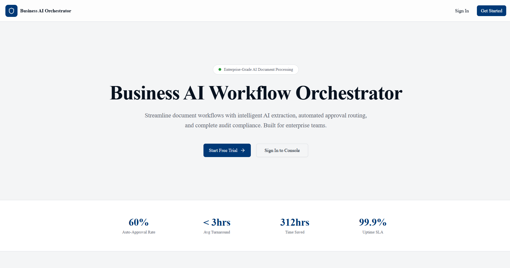
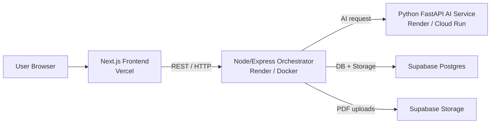
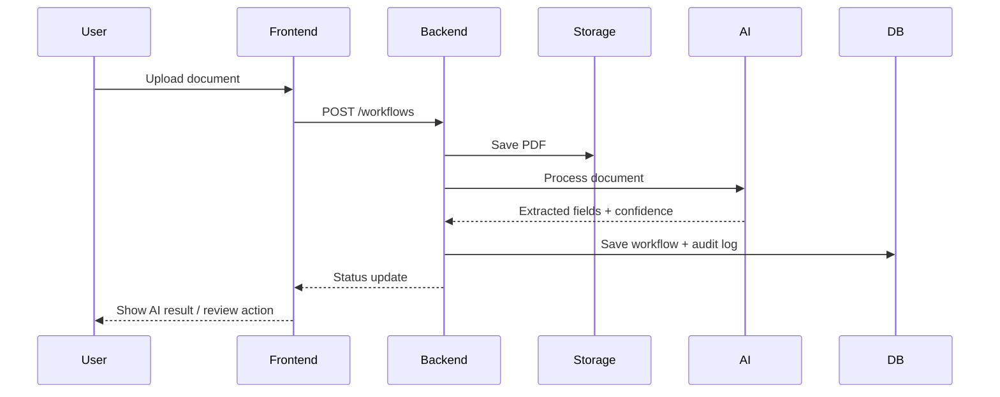

# 🤖 Business AI Workflow Orchestrator

<p align="center">
  
</p>

---

## ✨ Overview

Business AI Workflow Orchestrator is a production-style enterprise platform for intelligent document processing, workflow routing, approval management, and audit tracking.

It combines a modern Next.js frontend, a Node/Express backend orchestrator, and a Python FastAPI AI microservice to extract information from uploaded documents, apply business rules, and drive approval workflows with full traceability.

The architecture in the project plan follows this flow: browser → Next.js frontend → Express orchestrator → Python AI service → Supabase Postgres and storage.

---

## 🚀 Key Features

- 🤖 AI-powered document understanding with OCR + NLP
- 📄 Secure document upload and storage
- 🔐 JWT authentication and role-based access control
- ⚙️ Workflow state machine with approval routing
- ✅ Manual review, approve, reject, and request-changes actions
- 📜 Immutable audit logs and workflow history
- 📊 Metrics dashboard for business visibility
- ☁️ Cloud-ready deployment with Docker
- 🧩 Clean API contracts for frontend-backend integration
- 🛡️ Security-first design with environment-based secrets

---

## 🧠 System Architecture



The document explicitly recommends keeping the frontend on Vercel, hosting the backend and AI services as containers, and using Supabase for managed Postgres plus file storage.

---

## 🧱 Tech Stack

| Layer         | Technology                                        |
| ------------- | ------------------------------------------------- |
| Frontend      | Next.js, React, TypeScript, Tailwind CSS          |
| Backend       | Node.js, Express, JWT, bcrypt, pg, multer         |
| AI Service    | Python, FastAPI, pytesseract, spaCy, scikit-learn |
| Database      | PostgreSQL via Supabase                           |
| Storage       | Supabase Storage                                  |
| DevOps        | Docker, Docker Compose, Vercel, Render            |
| Observability | Logging, health checks, metrics endpoints         |

---

## 📂 Project Structure

```txt
frontend/
├── lib/
├── components/
├── pages/
└── styles/

backend/
├── src/
│   ├── routes/
│   ├── controllers/
│   ├── services/
│   └── middlewares/
├── migrations/
└── Dockerfile

ai-service/
├── app/
│   ├── main.py
│   ├── ocr.py
│   ├── nlp.py
│   └── schemas.py
├── requirements.txt
└── Dockerfile
```

---

## 🔄 Workflow



---

## 📌 Main Modules

### Frontend

- API client layer for backend integration
- Auth context and protected routes
- Dashboard, workflows, approvals, audit, metrics, profile
- File upload, AI preview, confirmation modal, toast handling

### Backend

- Authentication and role management
- Workflow creation, submission, approval, and audit events
- Supabase storage upload and Postgres persistence
- AI service communication and workflow engine

### AI Service

- OCR for image/PDF text extraction
- NLP for field parsing and classification
- Structured JSON response with confidence values and debug data

---

## 🧰 Environment Variables

Create and configure your environment files as needed.

```env
# Frontend
NEXT_PUBLIC_API_BASE_URL=http://localhost:4000

# Backend
BACKEND_PORT=4000
DATABASE_URL=postgresql://...
SUPABASE_URL=https://xyz.supabase.co
SUPABASE_SERVICE_ROLE=your_service_role_key
JWT_SECRET=your_strong_secret
AI_SERVICE_URL=http://localhost:8000

# AI Service
# (Add only if needed for your setup)
```

The project plan defines these variables consistently for frontend, backend, and AI service integration.

---

## ⚙️ Local Development

### 1) Frontend

```bash
cd frontend
npm install
npm run dev
```

### 2) Backend

```bash
cd backend
npm install
npm run dev
```

### 3) AI Service

```bash
cd ai-service
pip install -r requirements.txt
uvicorn app.main:app --host 0.0.0.0 --port 8000
```

### 4) With Docker Compose

```bash
docker-compose up --build
```

---

## 🗃️ Database Schema

The project uses Supabase Postgres tables for users, workflows, workflow history, audit logs, approvals, and metrics. The plan includes the SQL structure and recommends keeping the service role key server-side only.

---

## 🔌 API Endpoints

```txt
POST   /auth/signup
POST   /auth/login

POST   /workflows
GET    /workflows
GET    /workflows/:id

POST   /workflows/:id/submit
POST   /workflows/:id/approve

GET    /approvals
GET    /audit
GET    /metrics
```

These are the core REST contracts defined in the documentation for frontend-backend coordination.

---

## 🐳 Docker

### Backend Dockerfile

```dockerfile
FROM node:18-alpine
WORKDIR /usr/src/app
COPY package*.json ./
RUN npm ci --production
COPY . .
ENV NODE_ENV=production
EXPOSE 4000
CMD ["node", "dist/index.js"]
```

### AI Service Dockerfile

```dockerfile
FROM python:3.11-slim
WORKDIR /app
COPY requirements.txt .
RUN pip install --no-cache-dir -r requirements.txt
RUN python -m spacy download en_core_web_sm
COPY . .
EXPOSE 8000
CMD ["uvicorn", "app.main:app", "--host", "0.0.0.0", "--port", "8000"]
```

---

## 🚢 Deployment

### Frontend

- Deploy to **Vercel**
- Set `NEXT_PUBLIC_API_BASE_URL` to the backend production URL

### Backend

- Deploy to **Render** as a Docker web service
- Set environment variables securely in the dashboard

### AI Service

- Deploy separately on **Render**, **Cloud Run**, or similar container-friendly hosting

The project plan recommends Vercel for the Next.js frontend and container hosting for backend and AI services.

---

## 🔐 Security Notes

- Keep `SUPABASE_SERVICE_ROLE` only on the backend
- Use HTTPS in production
- Store JWT secrets in environment variables
- Add request validation and file size limits
- Enable CORS only for trusted origins
- Add rate limiting to sensitive routes
- Use Helmet for security headers

---

## 📈 Monitoring & Observability

Recommended additions:

- `/health` endpoint for uptime checks
- Structured logs for request tracing
- Error reporting for backend exceptions
- Metrics endpoint for dashboard statistics

---

## 🧪 Roadmap

- [X] Frontend integration plan
- [X] Backend orchestrator design
- [X] AI microservice design
- [X] Supabase schema plan
- [X] Docker and deployment strategy
- [ ] Production UI polish
- [ ] Advanced validation rules
- [ ] Email notifications
- [ ] Search and filtering improvements
- [ ] Expanded analytics

---

## 🤝 Contributing

1. Fork the repository
2. Create a feature branch
3. Commit your changes
4. Open a pull request

---

## 📝 License

Choose a license that matches your intended distribution model. A common option for open-source projects is MIT.

---

## 👤 Author

**Sayan Ghosh**

---

## ⭐ Final Note

This README is designed to present the project like a serious enterprise-grade product: clear architecture, strong feature positioning, practical setup steps, and a polished GitHub-first layout.
